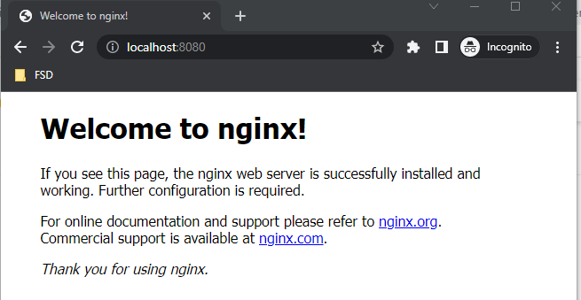

# Docker Lab Three

## Docker Networking

---

### Step 1: Lab objectives

This lab covers basic network management and container port management.

### Step 2: Setup

DYou should start this lab with no images or containers installed. If you have any containers running, you should stop them, then run docker container prune to remove all the stopped containers. Then ensure all the images you have locally are removed. You should know how to do that from the last lab
```bash
DD:\Docker>docker images
REPOSITORY   TAG       IMAGE ID   CREATED   SIZE

D:\Docker>docker ps -a
CONTAINER ID   IMAGE     COMMAND   CREATED   STATUS    PORTS     NAMES
```

### Step 3: Docker Networks

List the docker networks with `docker network ls`. The list of networks that see might be different on your machine, but you should see at least a bridge network

```bash
D:\Docker>docker network ls
NETWORK ID     NAME      DRIVER    SCOPE
f60a86532892   bridge    bridge    local
74dbc19ddc61   host      host      local
b0a01d01f8a8   none      null      local
```

Use the `docker network inspect host` to see the details of the host network.

```bash 
D:\Docker>docker network inspect host
[
    {
        "Name": "host",
        "Id": "74dbc19ddc61539fa054da92c675bf5f400fe9aa67f703986d79633d0d78e2ed",
        "Created": "2022-06-18T12:07:01.552073192Z",
        "Scope": "local",
        "Driver": "host",
        "EnableIPv6": false,
        "IPAM": {
            "Driver": "default",
            "Options": null,
            "Config": []
        },
        "Internal": false,
        "Attachable": false,
        "Ingress": false,
        "ConfigFrom": {
            "Network": ""
        },
        "ConfigOnly": false,
        "Containers": {},
        "Options": {},
        "Labels": {}
    }
]
```
Notice that there are no IP addresses specified. Containers deployed to the host network are on the same network as the Linux host.

The interesting network is the bridge network.

```bash
:\Docker>docker network inspect bridge
[
    {
        "Name": "bridge",
        "Id": "f60a865328925365a36768c08ae8c3cf866f71720dda34b2f7aaf82aec5acd1b",
        "Created": "2022-11-16T16:58:07.038194727Z",
        "Scope": "local",
        "Driver": "bridge",
        "EnableIPv6": false,
        "IPAM": {
            "Driver": "default",
            "Options": null,
            "Config": [
                {
                    "Subnet": "172.17.0.0/16",
                    "Gateway": "172.17.0.1"
                }
            ]
        },
        "Internal": false,
        "Attachable": false,
        "Ingress": false,
        "ConfigFrom": {
            "Network": ""
        },
        "ConfigOnly": false,
        "Containers": {},
        "Options": {
            "com.docker.network.bridge.default_bridge": "true",
            "com.docker.network.bridge.enable_icc": "true",
            "com.docker.network.bridge.enable_ip_masquerade": "true",
            "com.docker.network.bridge.host_binding_ipv4": "0.0.0.0",
            "com.docker.network.bridge.name": "docker0",
            "com.docker.network.driver.mtu": "1500"
        },
        "Labels": {}
    }
]
```

### Step 4: Containers, IPs and ports

PIn order to see that containers are deployed onto this network by default, run an ubuntu container interactively like you did in the last lab

`docker run -it –expose 8080 –name test ubuntu`

This command will expose port 8080 only while the container is running. The port on the container is exposed when the container starts up. Once the container exits, that port is no longer exposed.

Once you are in the bash shell, run the command `hostname -I` to get the IP address of the container. Note that it is the range of the bridge network.

```bash
D:\Docker>docker run -it --expose 8080 --name test ubuntu

root@f2916d162876:/# hostname -I
172.17.0.2
root@f2916d162876:/#
```
RIn a separate window, run the docker ps command to see that the port 8080 is open.

```bash
D:\Docker>docker ps
CONTAINER ID   IMAGE     COMMAND   CREATED         STATUS         PORTS      NAMES
f2916d162876   ubuntu    "bash"    6 minutes ago   Up 6 minutes   8080/tcp   test
```

Go back to the first window and exit the bash shell. Then rerun the docker ps -a command. Note that there are no ports exposed

```bash
D:\Docker>docker ps -a
CONTAINER ID   IMAGE     COMMAND   CREATED         STATUS                     PORTS     NAMES
f2916d162876   ubuntu    "bash"    8 minutes ago   Exited (0) 8 seconds ago             test

```

### Step 5: Port publishing

Even if a container exposes a port, it is still running on a private network. Port publishing is used by the Docker engine to map container ports to ports on the host network.

In this section, you will pull a web server Nginx image and run it. The container exposes port 80 on the Docker network, but the -p 8080:80 clause connects the container port 80 to the host port 8080.

```bash
DD:\Docker>docker run -p 8080:80 --name webby nginx
Unable to find image 'nginx:latest' locally
latest: Pulling from library/nginx
a603fa5e3b41: Pull complete
c39e1cda007e: Pull complete
90cfefba34d7: Pull complete
a38226fb7aba: Pull complete
62583498bae6: Pull complete
9802a2cfdb8d: Pull complete
Digest: sha256:e209ac2f37c70c1e0e9873a5f7231e91dcd83fdf1178d8ed36c2ec09974210ba
Status: Downloaded newer image for nginx:latest
/docker-entrypoint.sh: /docker-entrypoint.d/ is not empty, will attempt to perform configuration
... more stuff …
2022/11/17 13:52:16 [notice] 1#1: start worker process 40
2022/11/17 13:52:16 [notice] 1#1: start worker process 41
2022/11/17 13:52:16 [notice] 1#1: start worker process 42
2022/11/17 13:52:16 [notice] 1#1: start worker process 43
2022/11/17 13:52:16 [notice] 1#1: start worker process 44
```
Notice that that the running container is using the window it started up in as its standard output, which means you can’t enter anything until the container exits. In another terminal window, check the stats on the running container. Notice the port mapping which is saying that any IP address anywhere (0.0.0.0) can access the host port 8080 which will then by forwarded to the container port 80
Remove all the containers and images that you used in this lab.

```bash
D:\Docker>docker ps -a
CONTAINER ID   IMAGE     COMMAND                  CREATED          STATUS          PORTS                  NAMES
11aba9468dbe   nginx     "/docker-entrypoint.…"   26 minutes ago   Up 26 minutes   0.0.0.0:8080->80/tcp   webby
```

Confirm in a web browser that nginx is in fact running on localhost:8080



Now stop the running container using the `docker stop webby` command and check the stats for the stopped container. 

Check the window where you ran the container from and you will see that the container is no longer using it for standard output. Also check in a browser to confirm that the webserver is no longer running.

```bash
D:\Docker>docker stop webby
webby

D:\Docker>docker ps -a
CONTAINER ID   IMAGE     COMMAND                  CREATED          STATUS                     PORTS     NAMES
11aba9468dbe   nginx     "/docker-entrypoint.…"   56 minutes ago   Exited (0) 3 seconds ago             webby
```

### Step 6: Starting and stopping – detached mode

You can restart any stopped container. Restart the nginx container using the start command. Confirm that the webserver is running again on localhost:8080

```bash
D:\Docker>docker ps -a
CONTAINER ID   IMAGE     COMMAND                  CREATED       STATUS                      PORTS     NAMES
11aba9468dbe   nginx     "/docker-entrypoint.…"   2 hours ago   Exited (0) 38 minutes ago             webby

D:\Docker>docker start webby
webby

D:\Docker>docker ps
CONTAINER ID   IMAGE     COMMAND                  CREATED       STATUS         PORTS                  NAMES
11aba9468dbe   nginx     "/docker-entrypoint.…"   2 hours ago   Up 8 seconds   0.0.0.0:8080->80/tcp   webby
```

Note that the container started in what is called detached mode. This is the default when running a docker container except when using docker run. The container does not attach to the terminal and dump its standard output there.

Run a second webserver on localhost:8081 in detached mode using the -p option.

```bash
D:\Docker>docker run -d -p 8081:80 --name webby2 nginx
047025714ef29bbae6ebbd851d1ecb3acb8f4f6fe4e3d52c870c066df6e4a1ab

D:\Docker>docker ps
CONTAINER ID   IMAGE     COMMAND                  CREATED         STATUS         PORTS                  NAMES
047025714ef2   nginx     "/docker-entrypoint.…"   7 seconds ago   Up 5 seconds   0.0.0.0:8081->80/tcp   webby2
11aba9468dbe   nginx     "/docker-entrypoint.…"   2 hours ago     Up 5 minutes   0.0.0.0:8080->80/tcp   webby
```

Check that both web servers are running. Note that when webby2 started, the only output was the container ID.

### Step 7: Using Docker exec
Containers have a default command that is executed when the container is run. However, you can also start a container and specify a different command to run, assuming the command is available in the image.

For example, running nginx by default runs the web server. Run the bash shell instead as shown below. Ensure you are in the nginx container

```bash
D:\Docker>docker run -it nginx bash

root@b88de662afb9:/# ls
bin   dev                  docker-entrypoint.sh  home  lib64  mnt  proc  run   srv  tmp  var
boot  docker-entrypoint.d  etc                   lib   media  opt  root  sbin  sys  usr
root@b88de662afb9:/#
```

In a separate window, check the status of the container. Notice that the command listed is the default command, which you overrode and that there is no port mapping because you didn’t specify it.

```bash
D:\Docker>docker ps
CONTAINER ID   IMAGE     COMMAND                  CREATED         STATUS         PORTS     NAMES
b88de662afb9   nginx     "/docker-entrypoint.…"   5 minutes ago   Up 5 minutes   80/tcp    brave_keldysh
```

The `docker exec` command allows you to execute commands in a container just like you did with nginx, the difference is that exec is used to execute commands in running containers.

To see this, start nginx in detached mode and verify that the web server is running on the port you specified.

```bash
D:\Docker>docker run -d -p 8080:80 --name webby nginx
dbba3e391104ed34fbee5fbe2667c65c3034755379d43cd47cb8f246f1f17036

D:\Docker>docker ps
CONTAINER ID   IMAGE     COMMAND                  CREATED         STATUS         PORTS                  NAMES
dbba3e391104   nginx     "/docker-entrypoint.…"   9 seconds ago   Up 8 seconds   0.0.0.0:8080->80/tcp   webby
```

Now open a bash shell into the running container.

```bash
D:\Docker>docker exec -it webby bash

root@dbba3e391104:/# ls
bin   dev                  docker-entrypoint.sh  home  lib64  mnt  proc  run   srv  tmp  var
boot  docker-entrypoint.d  etc                   lib   media  opt  root  sbin  sys  usr
root@dbba3e391104:/#
```
In a separate window, confirm that there is exactly one container running.

```bash
D:\Docker>docker ps
CONTAINER ID   IMAGE     COMMAND                  CREATED         STATUS         PORTS                  NAMES
dbba3e391104   nginx     "/docker-entrypoint.…"   4 minutes ago   Up 4 minutes   0.0.0.0:8080->80/tcp   webby
```
Stop any running containers

---

## End of Lab

