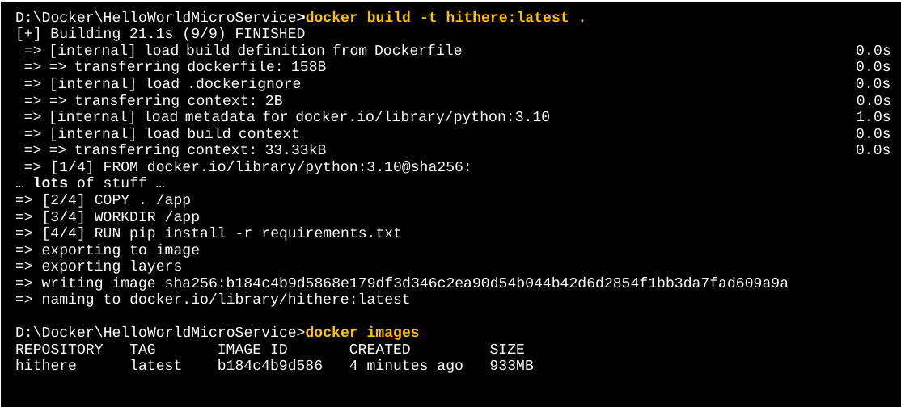

# Docker Lab Four

## Building Images

---

### Step 1: Lab objectives

This lab reviews the basics of building Docker containers using Docker build.

### Step 2: Setup

You should start this lab with no containers. If you have any containers running, you should stop them, then run `docker container prune` to remove all the stopped containers

### Step 3: Commit a container as an image

Run an Ubuntu image interactively. Inside the container, create a new file and name it distinctively so that you will know it was created by you. In the example below, the hosts file has just been copied to zippy.

```bash
D:\Docker>docker run -it --name ubbi ubuntu

root@04e34b49bcf9:/# cp /etc/hosts zippy
root@04e34b49bcf9:/# ls
bin   dev  home  lib32  libx32  mnt  proc  run   srv  tmp  var
boot  etc  lib   lib64  media   opt  root  sbin  sys  usr  zippy
root@04e34b49bcf9:/#
exit
```

Get the ID of the stopped container and then commit it as an image. In the example below, the new image is named ubbi:1.0.  Confirm that this image exists.

```bash
D:\Docker>docker ps -a
CONTAINER ID   IMAGE     COMMAND   CREATED              STATUS                          PORTS     NAMES
04e34b49bcf9   ubuntu    "bash"    About a minute ago   Exited (0) About a minute ago             ubbi

D:\Docker>docker commit 04e34b49bcf9 ubbi:1.0
sha256:6ce2dad011fada8866fdc210fbc9f3c966ffbc65a370066847062689fbc85264

D:\Docker>docker images
REPOSITORY   TAG       IMAGE ID       CREATED          SIZE
ubbi         1.0       6ce2dad011fa   10 seconds ago   77.8MB
nginx        latest    88736fe82739   3 days ago       142MB
```
Now run the new image and confirm that the file you created previously is now part of the image

```bash
D:\Docker>docker run -it  ubbi:1.0

root@4ad189ca9c33:/# ls
bin   dev  home  lib32  libx32  mnt  proc  run   srv  tmp  var
boot  etc  lib   lib64  media   opt  root  sbin  sys  usr  zippy
root@4ad189ca9c33:/#
exit
```

### Step 4: Build an image from a Dockerfile

Clone the repository from GitHub

https://github.com/ExgnosisClasses/HelloWorldMicroService

```bash
D:\Docker>git clone https://github.com/ExgnosisClasses/HelloWorldMicroService.git
Cloning into 'HelloWorldMicroService'...
remote: Enumerating objects: 18, done.
remote: Counting objects: 100% (18/18), done.
remote: Compressing objects: 100% (13/13), done.
remote: Total 18 (delta 6), reused 8 (delta 2), pack-reused 0
Receiving objects: 100% (18/18), done.
Resolving deltas: 100% (6/6), done.
```
This is a Python application for a hello world sort of web service. You will be covering what the code means in later sections when you build the Java equivalent application. For now, the Python app is more compact.

Notice that the image says the application will be using container port 5000.

```python
from flask import Flask
from flask import request

import os

app = Flask(__name__)

@app.route("/")
def hello():
    return "Welcome to the hello web service"

@app.route("/hello")
def helloanon():
   return "Hello anonymous user"

@app.route('/hello/<username>')
def helloname(username):
    if username == 'Jack' :
        return "HIT THE ROAD JACK!!!"
    else :
     return 'Hello {}'.format(username)

@app.route('/hello/<int:userid>')
def hellouserid(userid):	
    return 'Hello user unit number {:d}'.format(userid)

if __name__ == "__main__":
    port = int(os.environ.get("PORT", 5000))
    app.run(debug=True,host='0.0.0.0',port=port)
```

Examine the Dockerfile

```dockerfile
FROM python:3.10
COPY . /app
WORKDIR /app
RUN pip install -r requirements.txt
ENTRYPOINT ["python"]
CMD ["app.py"]
```

1. The base image is a Python image.
2. The contents of the directory the build is being executed in are copied to a the directory /app in the container that is then identified as the working directory 
3. The Python pip command is used to install the dependencies need to run the application
4. The ENTRYPOINT command specifies that the Python shell is executed at start up.
5. The CMD specifies what the Python shell should execute. 

Now run the build process. Make sure you are in the same directory as the Docker file. You can use whatever name you want as the image tag.

Notice the various intermediate containers that are started and stopped.  These are pruned automatically after the build is completed, as well as any intermediate images. Make sure that you remember to include the period at the end of the command.



Run the resulting image on port 80 and confirm it works.

```bash
D:\Docker>docker run -d -p 80:5000 hithere
47211bd9fb155e9b7bea360ee812a19d485eb6a9d501841f3d5cd2f1353e47ad
```

Now use exec to go into the running container and look at what its contents are. Because of the copy command, all of the contents of the build directory, including the readme file are in the container.

```bash
D:\Docker>docker ps
CONTAINER ID   IMAGE     COMMAND           CREATED          STATUS          PORTS                  NAMES
47211bd9fb15   hithere   "python app.py"   21 minutes ago   Up 21 minutes   0.0.0.0:80->5000/tcp   adoring_williams

D:\Docker>docker exec -it 47211bd9fb15 bash
root@47211bd9fb15:/app# ls
Dockerfile  README.md  app.py  requirements.txt
root@47211bd9fb15:/app#
exit
```
Remove any containers you used in this lab

---

## End of Lab

